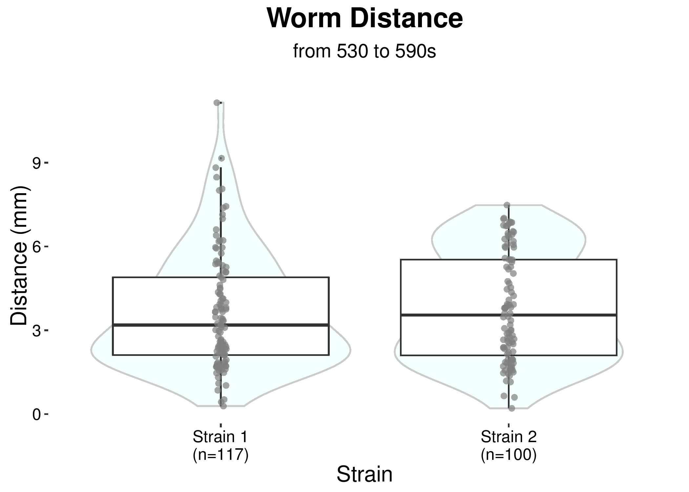

# Summary analysis of Locomotion experiments on the Multi-worm Tracker
The aim of this project is to create software that can be used after running
a 600s basal locomotion experiment using the Multi-worm tracker (Swierczek et al., 2011)
to generate summary figures and statistics for that experiment. 

This script can also back up experiment .zip files to a webdav server specified by the
user. 

## Figures it generates
* Speed versus time over experiment duration
* Radial and boxplot pathlength figures from 530-590s
* Spontaneous reversals/minute box plot (averaged over 470-590s)
* Body size box plots (area, length and width)

## Statistics reported
* Mean initial speed (averaged over 30-45s) for each strain, and ANCOVA comparing to wild-type
* Mean final speed (averaged over 575-590s) for each strain, and ANCOVA comparing to wild-type
* Mean pathlength measured over 530-590s for each strain, and ANCOVA comparing to wild-type
* Mean number of spontaneous reversals/minute (averaged over 470-590s) for each strain, and ANCOVA comparing to wild-type
* Mean area, length and width for each strain, and ANCOVA comparing to wild-type

## How to use it

### Installation Dependencies

`Java`, `R`, R packages `ggplot2`, `plyr`, `stringr`, `asbio`,and `fmsb`, and the Multi-worm Tracker 
Analysis software (`Chore.jar`) as a shell script in the executable path named `Chore`. 
To "easily" do this on a Mac or Linux OS, please follow the following installation 
instructions:

#### For Mac OSX
1. Install Homebrew by typing the following into the command line:

	~~~
	ruby -e "$(curl -fsSL https://raw.githubusercontent.com/Homebrew/install/master/install)"
	~~~
2. Install the Multi-worm Tracker Analysis software via Homebrew to install Chore.jar and
have it accesible as a shell script in the executable path named "Chore":

	~~~
	brew install homebrew/science/multi-worm-tracker
	~~~

#### For Linux
1. Install Linuxbrew by typing the following into the command line:

	~~~
	ruby -e "$(curl -fsSL https://raw.githubusercontent.com/Homebrew/linuxbrew/go/install)"
	~~~
2. Put brew in your executable path by adding the commands below to either `.bashrc` or 
`.zshrc`: 

	~~~
	export PATH="$HOME/.linuxbrew/bin:$PATH"
	export MANPATH="$HOME/.linuxbrew/share/man:$MANPATH"
	export INFOPATH="$HOME/.linuxbrew/share/info:$INFOPATH"
	~~~
	
3. Install the Multi-worm Tracker Analysis software via Homebrew to install Chore.jar and
have it accesible as a shell script in the executable path named "Chore":

	`brew install homebrew/science/multi-worm-tracker`

### Running the analysis on Mac OSX and Linux

* Set working directory to project's root directory

* Call `locomotion_driver.sh` from the `Bash Shell`

* `locomotion_driver.sh` requires the following arguments from the user:
  *(1) path to folder where MWT data folders are saved (absolute or relative to MWT root directory)
  *(2) path to folder where figures and statistics will be saved (aka "results") (absolute or relative)
  *(3) gigabytes of memory to be used to run Choreography (dependent upon the machine you are using)
  *(4) control strain, which will be plotted first and used as a baseline for radarplot strain comparisons. NOTE: input is case-sensitive!
  *(5) webdav server URL
  *(6) path on webdav where .zip folders should be saved (including where it is mounted on your computer (e.g. /path_on_webdav)
  
* To run analysis without backing up to webdav server do not provide webdav server URL (5) and path (6).

* Example usage of this script from the Bash Shell - with backup to webdav
(After working directory has been set to project's root directory):
`bash bin/locomotion_driver.sh data results 1 N2 https://webdav.server/location folder_to_backup_to`

* Example usage of this script from the Bash Shell - without backup to webdav:
 `bash bin/locomotion_driver.sh data results 1 N2`
 
For Windows, please see instructions in `windows_locomotion_driver.sh`. Using Homebrew with Windows in the script is still being developed.

#### This code is still a work in progress. More instructions to come as code is developed further.

## Development progress
### "Completed" Figures
* Boxplots with underlayed violin plots of worm size factors, averaged from 60 to 70 seconds for each worm.

* Plot of worm pathlengths from 530 to 590s. Worms not tracked over the entire interval are omitted. See Choreography documentation for information on pathlength.

* Plot of worm total distance travelled from 530 to 590s. Backward movement is included in total distance travelled.

* Path plot, showing the path travelled by each worm over the specified time intervals, beginning from the centre of the plot.

* Speed versus Time

### Figures in Progress

* Radar plots, using medians of each factor. Flexible margins need to be developed.

### To Do
* Develop windows shell script to use Homebrew or another method to avoid hardcoding path to Chore.jar
* Statistics

